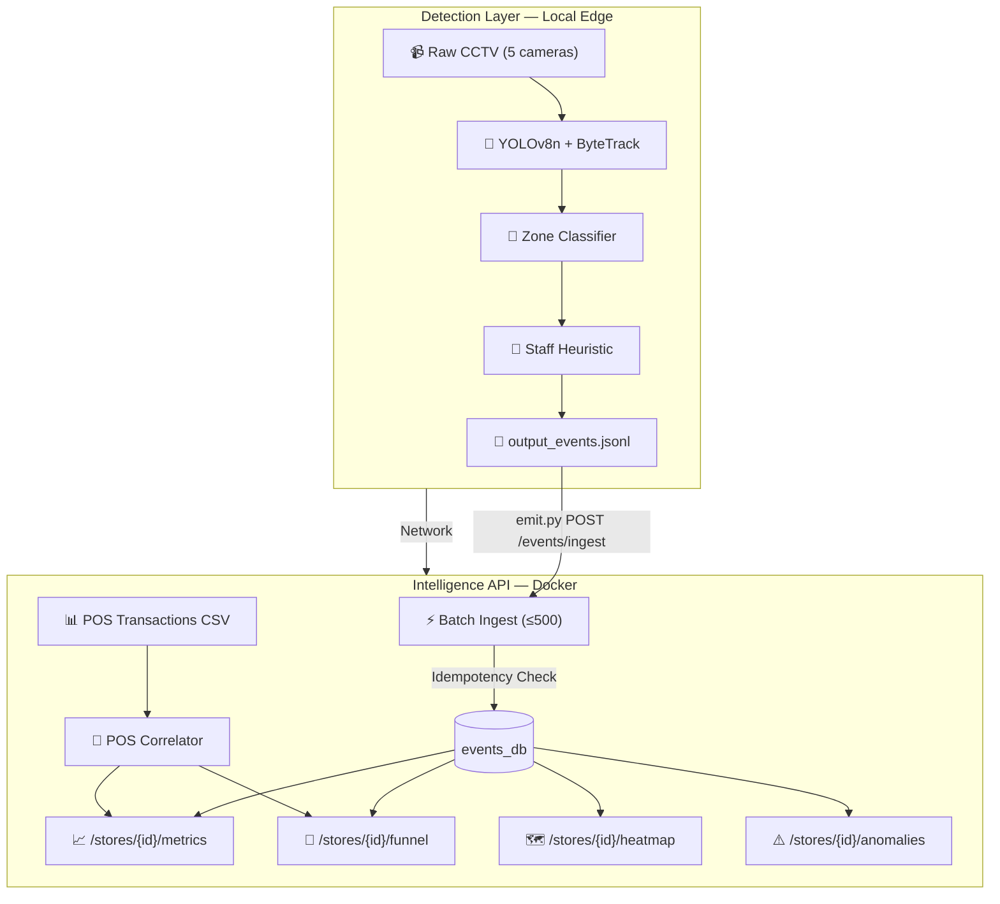

# Retail Intelligence System Architecture

## Overview

This system is a real-time analytics pipeline designed to convert unstructured physical retail CCTV footage into structured, queryable business intelligence. The ultimate business goal is measuring and optimizing the **Offline Store Conversion Rate** — the ratio of visitors who completed a purchase to the total unique visitors in a session window.

The architecture is split into two decoupled layers to ensure scalability and fault tolerance:

1. **Detection Layer (Python / YOLOv8 / ByteTrack):** Processes video frames from multiple cameras, tracks individuals using bounding boxes, classifies zones based on frame position, detects staff via presence-duration heuristics, and emits stateless JSON events covering the full visitor lifecycle (entry, zone transitions, dwell, billing queue, exit, and re-entry).

2. **Intelligence API (FastAPI / Docker):** Ingests the event stream, enforces idempotency by `event_id`, correlates visitor sessions with POS transaction data, and computes real-time North Star metrics including conversion rate, zone dwell times, funnel drop-off, heatmap intensity, and operational anomalies.

### System Architecture Diagram

### Detection Pipeline Architecture

The detection pipeline uses a **two-pass architecture** per camera clip:

- **Pass 1 (Collection):** Run YOLOv8 with ByteTrack tracking. For each frame, collect every tracked person's bounding-box centre, zone classification, and confidence score. This builds a per-visitor detection timeline.

- **Pass 2 (Event Generation):** Walk each visitor's timeline chronologically. Emit lifecycle events based on state transitions: first appearance → ENTRY, zone changes → ZONE_EXIT + ZONE_ENTER, sustained presence → ZONE_DWELL (every 30 seconds), disappearance → EXIT. Gaps exceeding 10 seconds between detections trigger REENTRY events.

- **Post-Processing:** Identify staff using a presence-duration heuristic (visitors detected in >60% of total frames are flagged as `is_staff=true`). Sort all events by timestamp and write to JSONL.

### Zone Classification

Since the store layout PDF cannot be parsed programmatically in the pipeline, zones are assigned based on bounding-box centre position relative to the camera frame:

| Camera Type | Zone Assignment |
|:---|:---|
| Entry camera (CAM 1) | Entire FOV → `ENTRY` zone |
| Floor cameras (CAM 2, 3, 5) | Quadrant-based: top-left = `SKINCARE`, top-right = `MAKEUP`, bottom-left = `FRAGRANCE`, bottom-right = `HAIRCARE` |
| Billing camera (CAM 4) | Entire FOV → `BILLING` zone |

This trade-off is documented in CHOICES.md. The quadrant-based approach is approximate but provides meaningful zone differentiation for funnel and heatmap analysis.

### API Endpoint Design

All six endpoints serve complementary views of the same underlying event data:

| Endpoint | Purpose | Key Logic |
|:---|:---|:---|
| `POST /events/ingest` | Batch ingestion | Idempotent by `event_id`, ≤500 batch limit |
| `GET /stores/{id}/metrics` | Core KPIs | POS-correlated conversion, zone dwell averages |
| `GET /stores/{id}/funnel` | Conversion funnel | Session-based Entry → Zone → Billing → Purchase |
| `GET /stores/{id}/heatmap` | Zone intensity | Visit frequency + dwell normalised 0–100 |
| `GET /stores/{id}/anomalies` | Operational alerts | Queue spikes, conversion drops, dead zones |
| `GET /health` | Service status | Per-store stale-feed detection (>10 min lag) |

## AI-Assisted Decisions

I utilized an LLM to accelerate the system design and enforce strict schema compliance:

* **Schema Validation:** I used AI to help map the complex nested JSON constraints from the problem statement into robust Pydantic models in FastAPI. *Result:* I agreed with the AI's approach as Pydantic automatically handles 400-level errors for malformed batch ingests.

* **Tracking Optimization:** I initially planned a custom distance-based Re-ID script. The AI suggested utilizing YOLOv8's native ByteTrack integration (`tracker="bytetrack.yaml"`). *Result:* I agreed and implemented this, as it significantly reduced processing latency and handled frame-to-frame occlusion much better than a custom Euclidean distance script.

* **Two-Pass Pipeline Design:** When discussing how to handle event generation from raw detections, the AI suggested a two-pass approach (collect first, then generate events) rather than emitting events in real-time during frame processing. *Result:* I agreed — the two-pass approach is cleaner, avoids premature event emission during occlusion gaps, and enables post-hoc staff classification across the complete timeline.

* **POS Correlation Strategy:** The AI recommended correlating POS transactions with billing-zone visitor sessions using a configurable time-window approach (5-minute default). *Result:* I adopted this and made the window configurable, since different store layouts may have varying distances between the billing zone and POS terminal.